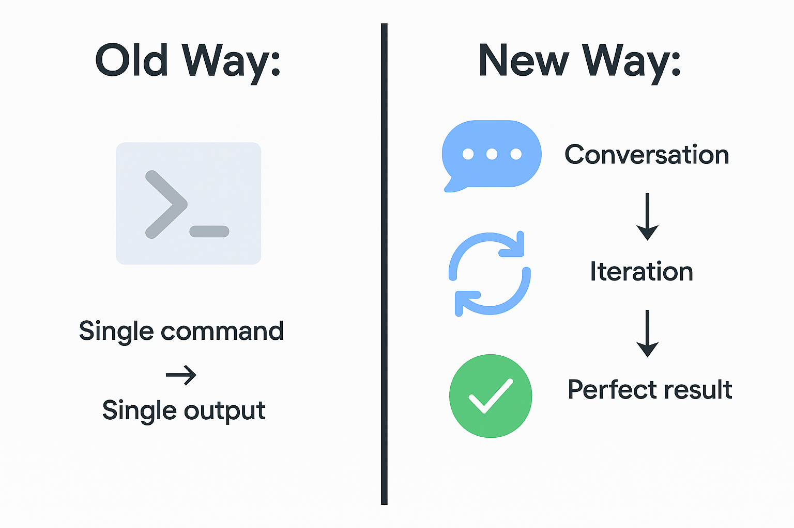
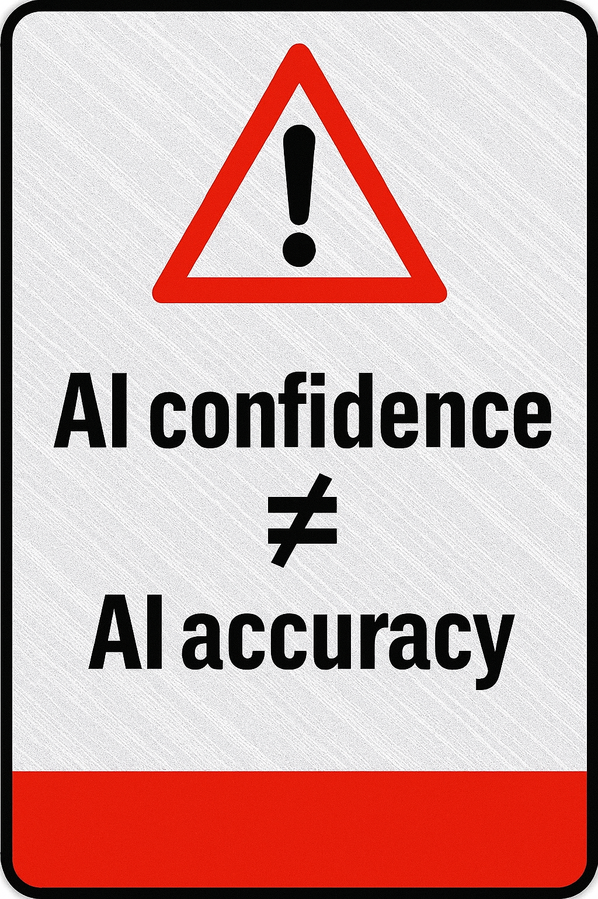
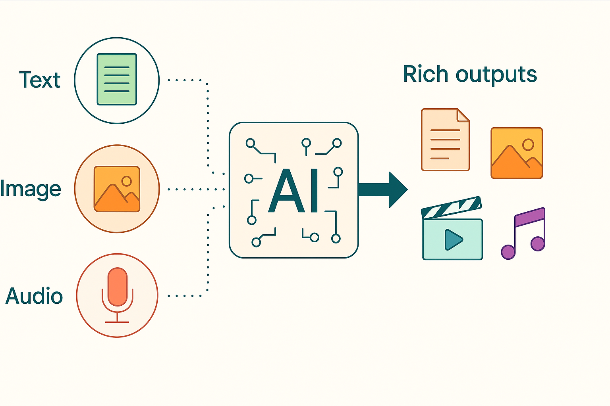

# 🤖 5 Surprising Truths About Getting What You Want from AI
### Insights from Google's Leading AI Experts

---

You've tried generative AI. Sometimes it feels like magic—other times, like talking to a wall. Sound familiar?

After diving deep into wisdom from Google's AI experts, I discovered something crucial: **there's no magic phrase or secret command.** The real breakthrough comes from shifting how you think about AI entirely.

Effective prompting isn't about crafting one perfect instruction. It's about learning to collaborate in an entirely new way. Here are five game-changing truths that will transform your AI interactions.

---

## 💬 1. It's a Conversation, Not a Command

**Stop thinking vending machine. Start thinking creative partner.**

The biggest mindset shift? AI isn't a one-shot deal where you input a command and expect perfection. Real power emerges through iterative dialogue—a genuine back-and-forth.

This mirrors how we naturally work with humans. You wouldn't expect a designer to nail the perfect logo from a single sentence, right? You'd collaborate, give feedback, refine the vision.

*Figure 1: Old way vs New way* 

**Real-world example:** Tris, Director of Product Management at Google DeepMind, needed a team logo. His first attempt? Weird results. But instead of giving up, he started a conversation:
- First refinement: specified colors
- Second refinement: requested "line art" style
- Result: Powerful concepts that inspired the final design

> "It's not one and done at all. It's important to be careful that maybe there's a factual error being shown. But the iteration is what can get it to be what actually solves the task that I've got."  
> — **Anoop**, Research Director at Google

Google's experts call this principle **"Always Be Iterating" (ABI)**. Each output is simply your next opportunity to refine and improve.

---

## ⚠️ 2. The AI Is Confidently Wrong—and That's Your Responsibility

Here's an uncomfortable truth: **AI hallucinates.**

These "hallucinations" are outputs that don't match reality—from completely fabricated facts to subtly incorrect details that slip past unnoticed. The latter is particularly dangerous.

*Figure 2: confidence is not equal to accuracy* 

### **Critical Rule:** You are the human in the loop. Always verify.

> "I'm not taking what the large language model has suggested as ground truth because it's not. It requires checking."

**Your verification toolkit:**
- ✅ Use built-in fact-checking features (like Gemini's)
- ✅ Cross-reference with traditional search engines
- ✅ Validate against your own expertise
- ✅ Consult colleagues or your professional community

Think of AI as an incredibly talented intern: brilliant at generating ideas, but requiring supervision.

---

## 👔 3. Give the AI a Job Title

One simple trick that dramatically improves results? **Assign a persona.**

Instead of:
> "Write a marketing plan"

Try:
> "You're a senior marketing executive with 15 years of B2B SaaS experience. Create a marketing plan for..."

*Figure 3: Give the AI a persona* 

This single instruction helps the AI:
- 🎯 Filter out irrelevant information
- 📝 Adopt the appropriate tone and style
- 🧠 Apply relevant expertise and perspective

> "I like to include things like the persona. If I'm looking for a marketing plan, I'll start by saying, 'Imagine you're a world-class marketer and you're marketing for this budget and this timeline,' really providing a starting point."  
> — **Laura**, Productivity Advisor at Google

---

## 📸 4. Show, Don't Just Tell—Welcome to Multimodal Prompting

Why limit yourself to text when you can **combine words, images, and more?**

Multimodal prompting reflects how humans naturally experience the world—building understanding through multiple senses simultaneously.

*Figure 4: Multimodal Prompting* 

### **Game-changing applications:**

**Personal:**
- 📷 Snap a photo of nail art → Get social media captions
- 🎨 Upload a design inspiration → Receive style analysis

**Professional:**
- 📊 Photograph a complex chart → Request plain-language explanations
- 📅 Share a conference schedule → Extract key events into a formatted table
- 🏗️ Picture a broken item → Get troubleshooting steps

This capability transforms AI from a text processor into a true creative collaborator that understands your world the way you experience it.

---

## 🗣️ 5. You're Learning a New Language—And It's Your Own

Here's the paradigm shift: **For the first time ever, computers are learning to speak *our* language.**

Not Python. Not command-line syntax. Not complex menus. **Human conversation.**

*Figure 5: Today Computers learn human language* 

> "I think this is the new language. It's the new language by which we converse with computers. And the amazing part is that for the first time, computers actually listen to us. They talk the way that we want to talk."  
> — **Tris**, Director of Product Management at Google DeepMind

**What this means for you:**

For decades, using technology meant learning *its* rules—whether mastering keyboard shortcuts, memorizing commands, or navigating endless menus. That barrier is disappearing.

This conversational interface **democratizes technology**. You can now bring your:
- ✨ Unique personality
- 🎨 Creative vision  
- 💡 Specific intent

...directly to the machine. Technology finally adapts to *you*.

---

## 🚀 The Bottom Line

Getting exceptional results from generative AI requires five fundamental shifts:

1. **Think dialogue, not monologue** → Embrace iteration
2. **Verify everything** → You're the essential human safeguard
3. **Assign roles** → Give AI the context to excel
4. **Go multimodal** → Communicate beyond text
5. **Embrace the new language** → You already speak it fluently

*Figure 6: Person collaborating with AI * 

---

## 💭 Your Turn

The computer finally speaks our language. The question isn't whether you should use this technology—it's already transforming how we work, create, and solve problems.

**The real question is: What will *you* create first?**

---

*Ready to level up your AI skills? Start treating it like a collaborator today, and watch what becomes possible.*